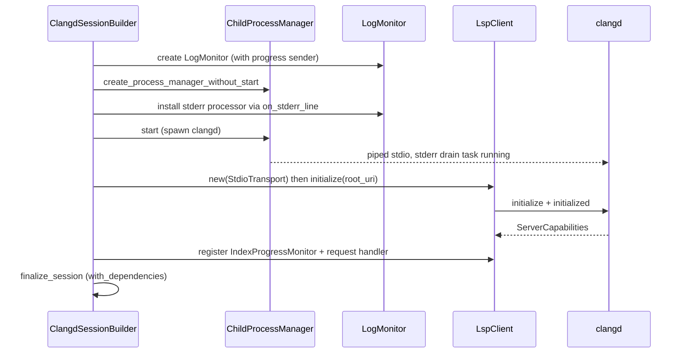
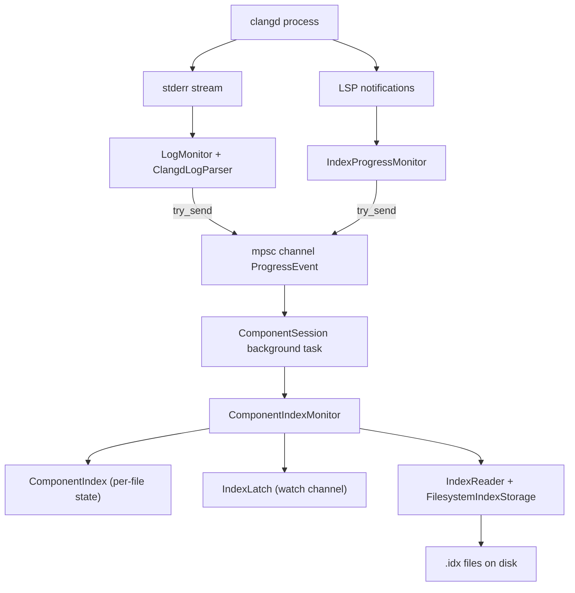

# Clangd Session and Indexing

`src/clangd` and `src/lsp` together spawn and speak to a clangd language server, track its indexing progress, and parse its on-disk index files. The layers, bottom to top, are IO (`src/io`) -> LSP (framing -> JSON-RPC -> typed client) -> clangd session (config -> builder -> session + monitors).

## Configuration

`ClangdConfig` (`src/clangd/config.rs`) is the immutable, validated config produced by `ClangdConfigBuilder`. Key fields:

- `working_directory` - clangd process CWD (set to the project root by `ComponentSession`).
- `clangd_path` - defaults to `"clangd"`.
- `build_directory` - must contain `compile_commands.json` (validated by the builder).
- `extra_args` - additional clangd args.
- `lsp_config: LspConfig` - `root_uri`, `initialization_timeout` (default 30s, max 5min), `request_timeout` (default 10s), `verbose_tracing`, client name/version.
- `resource_config: ResourceConfig` - `stderr_log_path`, `max_memory_mb`, `process_priority`, `background_indexing` (default true), `pch_storage` (Memory/Disk, default Memory), `index_threads`, `max_concurrent_processes`.

`ClangdConfigBuilder::build()` validates paths exist, timeouts are positive and within bounds, and args contain no NUL bytes. `get_clangd_args()` builds the argv with two notable invariants:
- `--compile-commands-dir` prefers the working directory if a `compile_commands.json` is reachable there, so clangd reuses `.cache/clangd/index` instead of reindexing.
- Thread count is emitted as `-j N` (not `--threads`) because some bundled clangd builds reject `--threads`.

`ClangdVersion::detect(path)` parses `clangd --version` output. `index_format_version()` maps the major version to the clangd index format version (10->12, 11->13, 12/13->16, 14/15->17, 16/17->18, 18/19->19, 20->20). This version selects the hash function used to name `.idx` files.

## Session lifecycle

`ClangdSession<P, C>` (`src/clangd/session.rs`) is generic over `ProcessManager` and `LspClientTrait`. The production type is `ClangdSession<ChildProcessManager, LspClient<StdioTransport>>`. `ClangdSessionTrait` abstracts it for tools and tests.

`ClangdSessionBuilder` (`src/clangd/session_builder.rs`) uses **phantom-type state markers** (`HasConfig`/`NoConfig`, `HasProcessManager`/`NoProcessManager`, `HasLspClient`/`NoLspClient`) so `build()` is only callable with a config, and the production (real spawn) versus testing (no spawn) impl is selected by which dependencies are injected. The production build:

1. Creates a `LogMonitor` (optionally `with_sender` for `ProgressEvent`).
2. Builds a `ChildProcessManager` without starting it.
3. Installs the `LogMonitor` stderr processor via `on_stderr_line` **before** `start()`, so the first stderr line is captured.
4. Starts the process (spawns clangd with piped stdio; stderr is always drained to prevent blocking).
5. Creates the `LspClient`, calls `initialize(root_uri)` wrapped in a timeout.
6. Registers the `IndexProgressMonitor` notification handler and a request handler that accepts `window/workDoneProgressCreate`.
7. Assembles the session via `with_dependencies`.

**Shutdown**: `close(self)` sends `shutdown` (with timeout), `exit`, closes the client, then `process_manager.stop(Graceful)`. **Drop fallback**: if still running when dropped without `close()`, logs a warning and calls `kill_sync()` (synchronous SIGKILL) - the safety net, not the primary path.

## LSP layer

`LspFraming<T: Transport>` (`src/lsp/framing.rs`) wraps any `Transport` and adds `Content-Length: N\r\n\r\n<content>` framing. Messages are capped at 16 MB. It accumulates raw bytes and parses complete messages, handling partial frames.

`JsonRpcClient<T>` (`src/lsp/protocol.rs`) is the async JSON-RPC 2.0 engine. On construction it spawns a transport task that `tokio::select!`s between outbound sends and inbound receives, classifies each message (`JsonRpcMessage::classify`), matches responses by `u64` id to pending request channels, fans notifications out to all registered handlers, and dispatches requests to a single request handler. `request_with_timeout` handles `Value::Null` results (for LSP `shutdown`). Errors: `JsonRpcError::{Server, Transport, Serialization, Deserialization, Timeout, RequestCancelled, MissingResult}`.

`LspClient<T>` (`src/lsp/client.rs`) wraps `JsonRpcClient` with typed `lsp_types` request/notification methods (compile-time-checked method strings). It advertises client capabilities (hover markdown, definition/declaration/typeDefinition/implementation with `linkSupport`, references, documentSymbol with all 26 symbol kinds, `window.workDoneProgress`). Every operation guards on `self.initialized`. A documented clangd quirk: clangd (LLVM 20) ignores `linkSupport` and returns `Location[]`; the code handles both `Location` and `LocationLink`.

`LspClientTrait` (`src/lsp/traits.rs`) is `#[cfg_attr(test, mockall::automock)]`, producing `MockLspClientTrait` for session polymorphism.

## File and diagnostics management

`ClangdFileManager` (`src/clangd/file_manager.rs`) tracks LSP-open documents in `HashMap<PathBuf, FileEntry>` (URI, SHA-256 content hash, monotonic version). `ensure_file_ready(path, client)` canonicalizes the path, reads content, hashes it, and:
- if open and hash unchanged -> no-op,
- if open and hash changed -> `didChange` (full-document),
- if not open -> `didOpen` with a language ID derived from extension (`.c`->`c`, `.cpp/.cc/.cxx/.cppm` and headers ->`cpp`, default `cpp`).

`DiagnosticsCollector` (`src/clangd/diagnostics.rs`) is `Clone`-able shared state that captures `textDocument/publishDiagnostics` notifications. Its handler spawns a background task per notification (never blocking the transport), stores diagnostics keyed by URI string, and deliberately stores empty lists (clean file vs. not-yet-parsed). `wait_for_uri(uri, timeout)` polls every 50ms. `reset_for_uri` clears the cache so the next publish is fresh.

## Indexing subsystem

Indexing is tracked from **two sources** that both emit `ProgressEvent` (`src/clangd/index/progress_events.rs`): LSP progress notifications and stderr log parsing.

### IndexProgressMonitor (LSP source)

`IndexProgressMonitor` (`src/clangd/index/progress_monitor.rs`) listens for LSP `$/progress` and `window/workDoneProgressCreate` notifications, tracking **only** the token `"backgroundIndexProgress"`. It parses `"current/total"` report messages and emits `OverallIndexingStarted`, `OverallProgress`, `OverallCompleted` events. Handlers spawn a background task per notification. State: `IndexingStatus` (`NotStarted`/`InProgress{current,total,percentage,message}`/`Completed`/`Failed`).

### LogMonitor (stderr source)

`LogMonitor` (`src/clangd/log_monitor.rs`) parses clangd's verbose stderr output. `ClangdLogParser` compiles eight regexes matching lines like `Indexing <path>`, `Indexed <path> (N symbols, M refs, K files)`, AST-failure patterns, and standard-library indexing lines, mapping them to `ProgressEvent` variants. Events are sent with `try_send` (best-effort, no back-pressure).

### ComponentIndex (pure data)

`ComponentIndex` (`src/clangd/index/component_index.rs`) is a pure in-memory mapping from source files to expected `.idx` file paths plus per-file state. Constructed from a `CompilationDatabase` and `ClangdVersion`:
- index directory is `<cdb_dir>/.cache/clangd/index`,
- for each source file, the index filename is `{basename}.{hash:016X}.idx` where the hash is computed by `compute_file_hash(path, format_version)` (`src/clangd/index/hash.rs`): **xxHash64 for format version <=18** (clangd 12-18) and **xxh3_64bits for format >=19** (clangd 19-20). This must match clangd's own file-naming hash.
- per-file state machine: `FileIndexState` (`Pending`/`InProgress`/`Indexed`/`Failed(String)`).

`ComponentIndex` contains no I/O - it is purely data management. Reconciliation with disk is the job of `ComponentIndexMonitor` in `src/project/index/`.

### IdxParser (binary index files)

`IdxParser` (`src/clangd/index/idx_parser.rs`) parses clangd's binary `.idx` files (RIFF/CdIx container), supporting format versions 12-20. A `.idx` file contains `meta` (4-byte LE format version), `stri` (optionally zlib-compressed string table), and optional `srcs` (include graph nodes). Types: `IncludeGraphNode` (flags, URI, 8-byte digest, direct includes), `IdxFileData` (format_version, include_graph, string_table). Helpers include LEB128 varint decoding. See [docs/clangd_index_spec.md](../docs/clangd_index_spec.md) in the repo for the full format specification.

### IndexLatch (completion coordination)

`IndexLatch` (`src/clangd/index/latch.rs`) is a `tokio::sync::watch`-based completion latch, `Clone`-able for multiple waiters. State: `Pending`/`Completed`/`Failed(String)`. `wait(timeout)` checks current state first (handles trigger-before-wait race) then awaits a change. `trigger_success`/`trigger_failure` are **idempotent** (only act when `Pending`). Errors: `LatchError::{Timeout, Cancelled, IndexingFailed}`.

### ComponentIndexMonitor (project layer)

`ComponentIndexMonitor` (`src/project/index/component_monitor.rs`) consolidates index state for one build directory. It owns a `ComponentIndex`, an `IndexLatch`, an `IndexReader` (backed by `FilesystemIndexStorage`), and an `IndexTrigger`. It consumes `ProgressEvent`s from the background channel, reconciles per-file state against disk `.idx` files, and triggers indexing of uncovered files by opening them through `ClangdIndexTrigger` (which calls `ClangdFileManager::ensure_file_ready`). `ComponentIndexingState`: `Init`/`InProgress(f32)`/`Partial`/`Completed`. `IndexStatusView` (`src/project/index/status.rs`) is the user-facing progress report (in_progress, percentage, indexed/total files, ETA).

## IO layer

`ChildProcessManager` (`src/io/process.rs`) spawns clangd with piped stdio, takes all three streams immediately on `start()`, and always runs a stderr drain task (even with no handler) to prevent pipe-full blocking. `stop(Graceful)` sends SIGTERM then SIGKILL on Unix (Windows warns). `kill_sync()` is the synchronous Drop safety net.

`StdioTransport` (`src/io/transport.rs`) is channel-based: a stdin writer task and a stdout reader task that accumulates raw bytes and emits only complete valid UTF-8 prefixes, retaining partial multibyte sequences across reads and compacting the buffer to prevent unbounded growth. `MockTransport` records sent messages and returns preloaded responses.

`FileBuffer<F>` (`src/io/file_buffer.rs`) is a UTF-8-normalized, line-indexed file view with auto-refresh on modification; columns are UTF-8 code points. `FileBufferManager` caches buffers by path with a manager-owned `FileSystemTrait` (real or `TestSystem`) for DI.