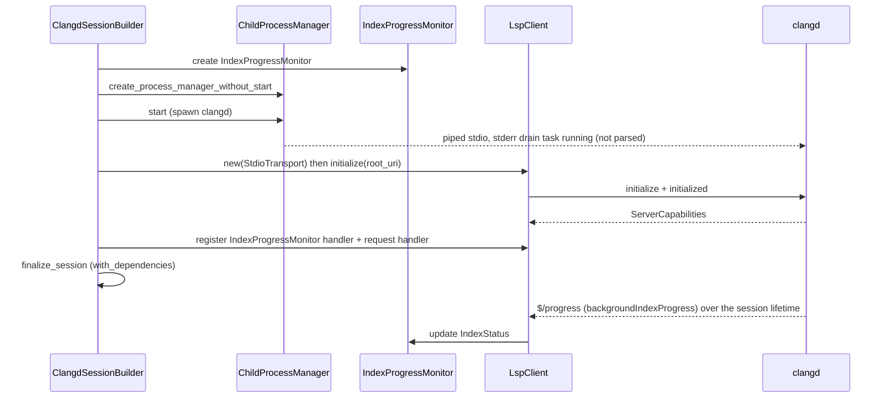

# Clangd Session and Indexing

`src/clangd` and `src/lsp` together spawn and speak to a clangd language server and report its background-indexing progress directly from clangd's standard LSP `$/progress` notifications. The server no longer maintains a client-side index model, parses on-disk `.idx` shard files, or parses clangd stderr for progress. The layers, bottom to top, are IO (`src/io`) -> LSP (framing -> JSON-RPC -> typed client) -> clangd session (config -> builder -> session + progress monitor).

## Configuration

`ClangdConfig` (`src/clangd/config.rs`) is the immutable, validated config produced by `ClangdConfigBuilder`. Key fields:

- `working_directory` - clangd process CWD (set to the project root by `ComponentSession`).
- `clangd_path` - defaults to `"clangd"`.
- `build_directory` - a directory from which a `compile_commands.json` is reachable (validated by the builder).
- `extra_args` - additional clangd args appended after the generated argv.
- `lsp_config: LspConfig` - `root_uri`, `initialization_timeout` (default 30s, max 5min), `request_timeout` (default 30s), `verbose_tracing`, client name/version.
- `resource_config: ResourceConfig` - `stderr_log_path`, `workspace_symbol_limit` (emitted as `--limit-results`), `process_priority`, `background_indexing` (default true), `pch_storage` (Memory/Disk, default Memory), `index_threads`, `max_concurrent_processes`.

`ClangdConfigBuilder::build()` validates paths exist, timeouts are positive and within bounds, and args contain no NUL bytes. `get_clangd_args()` builds the argv with these notable invariants:
- `--compile-commands-dir` prefers the working directory if a `compile_commands.json` is reachable there, so clangd reuses `.cache/clangd/index` instead of reindexing.
- Thread count is emitted as `-j N` (not `--threads`) because some bundled clangd builds (e.g. VS Code 22.1.0) reject `--threads`.
- `--limit-results` is emitted exactly once here; callers must never append their own `--limit-results` because clangd takes the last occurrence.
- `--log=verbose` is **not** added. It produces a huge stderr volume that adds parsing overhead, and clangd's `$/progress` notifications arrive through the LSP client regardless of log verbosity. The generated flags align with the set VS Code uses for clangd.

> `ClangdConfig` is the per-session shape derived from the resolved `AppConfig`. The layered `src/config` subsystem (CLI args > environment variables > `.mcp-cpp.yaml` > compiled defaults) is described in [Architecture](overview.md) and the [Project and Workspace](project-workspace.md) subsystem page; it is the portability layer that lets the same checkout behave identically across machines without per-machine source edits.

## Session lifecycle

`ClangdSession<P, C>` (`src/clangd/session.rs`) is generic over `ProcessManager` and `LspClientTrait`. The production type is `ClangdSession<ChildProcessManager, LspClient<StdioTransport>>`. `ClangdSessionTrait` abstracts it for tools and tests. The session owns an `IndexProgressMonitor` (cloneable, `watch`-channel backed) and exposes it through `index_progress_monitor()`.



`ClangdSessionBuilder` (`src/clangd/session_builder.rs`) uses **phantom-type state markers** (`HasConfig`/`NoConfig`, `HasProcessManager`/`NoProcessManager`, `HasLspClient`/`NoLspClient`) so `build()` is only callable with a config, and the production (real spawn) versus testing (no spawn) impl is selected by which dependencies are injected. The production build:

1. Builds a `ChildProcessManager` without starting it.
2. Starts the process (spawns clangd with piped stdio; stderr is always drained to prevent pipe-full blocking, but the drain is no longer wired to any progress parser).
3. Creates the `LspClient`, calls `initialize(root_uri)` wrapped in a timeout.
4. Creates an `IndexProgressMonitor` and registers its notification handler (plus a request handler that accepts `window/workDoneProgressCreate`).
5. Assembles the session via `with_dependencies`.

**Shutdown**: `close(self)` sends `shutdown` (with timeout), `exit`, closes the client, then `process_manager.stop(Graceful)`. **Drop fallback**: if still running when dropped without `close()`, logs a warning and calls `kill_sync()` (synchronous SIGKILL) - the safety net, not the primary path.

## LSP layer

`LspFraming<T: Transport>` (`src/lsp/framing.rs`) wraps any `Transport` and adds `Content-Length: N\r\n\r\n<content>` framing. Messages are capped at 16 MB. It accumulates raw bytes and parses complete messages, handling partial frames.

`JsonRpcClient<T>` (`src/lsp/protocol.rs`) is the async JSON-RPC 2.0 engine. On construction it spawns a transport task that `tokio::select!`s between outbound sends and inbound receives, classifies each message (`JsonRpcMessage::classify`), matches responses by `u64` id to pending request channels, fans notifications out to all registered handlers, and dispatches requests to a single request handler. `request_with_timeout` handles `Value::Null` results (for LSP `shutdown`). Errors: `JsonRpcError::{Server, Transport, Serialization, Deserialization, Timeout, RequestCancelled, MissingResult}`.

`LspClient<T>` (`src/lsp/client.rs`) wraps `JsonRpcClient` with typed `lsp_types` request/notification methods (compile-time-checked method strings). It advertises client capabilities (hover markdown, definition/declaration/typeDefinition/implementation with `linkSupport`, references, documentSymbol with all 26 symbol kinds, `window.workDoneProgress`). Every operation guards on `self.initialized`. A documented clangd quirk: clangd (LLVM 20) ignores `linkSupport` and returns `Location[]`; the code handles both `Location` and `LocationLink`.

`LspClientTrait` (`src/lsp/traits.rs`) is `#[cfg_attr(test, mockall::automock)]`, producing `MockLspClientTrait` for session polymorphism.

## File and diagnostics management

`ClangdFileManager` (`src/clangd/file_manager.rs`) tracks LSP-open documents in `HashMap<PathBuf, FileEntry>` (URI, SHA-256 content hash, monotonic version). `ensure_file_ready(path, client)` canonicalizes the path, reads content, hashes it, and:
- if open and hash unchanged -> no-op,
- if open and hash changed -> `didChange` (full-document),
- if not open -> `didOpen` with a language ID derived from extension (`.c`->`c`, `.cpp/.cc/.cxx/.cppm` and headers ->`cpp`, default `cpp`).

`DiagnosticsCollector` (`src/clangd/diagnostics.rs`) is `Clone`-able shared state that captures `textDocument/publishDiagnostics` notifications. Its handler spawns a background task per notification (never blocking the transport), stores diagnostics keyed by URI string, and deliberately stores empty lists (clean file vs. not-yet-parsed). `wait_for_uri(uri, timeout)` polls every 50ms. `reset_for_uri` clears the cache so the next publish is fresh.

## Index status (direct clangd progress)

Index status is tracked from a **single source**: clangd's standard LSP `$/progress` notifications on the `backgroundIndexProgress` token. The server performs no client-side index bookkeeping, reads no on-disk `.idx` shard files, and parses no clangd stderr. This was an intentional simplification: the previous client-side index model duplicated clangd's own indexing work, consumed substantial CPU and memory on large trees, and delayed clangd itself.

```mermaid
flowchart TD
    Clangd["clangd process"]
    LSP["LSP $/progress (backgroundIndexProgress)"]
    IPM["IndexProgressMonitor\n(src/clangd/progress.rs)"]
    Status["IndexStatus (watch channel)"]
    Tools["search_symbols / analyze_symbol_context / get_index_status"]

    Clangd -->|begin/report/end| LSP
    LSP --> IPM
    IPM -->|update| Status
    Tools -->|status() / wait_for_completion()| Status
```

### IndexProgressMonitor

`IndexProgressMonitor` (`src/clangd/progress.rs`) is a `Clone`-able monitor backed by a `tokio::sync::watch` channel. It holds the latest `IndexStatus` behind an `Arc<Mutex<IndexStatus>>` and a `watch::Sender<IndexStatus>` so multiple waiters can subscribe.

`create_handler()` returns a notification handler that spawns a background `tokio::task` per notification (never blocking the transport loop). The handler:
1. Filters for `$/progress` notifications whose `token` is the string `"backgroundIndexProgress"`.
2. Reads the `value.kind`:
   - `"begin"` or `"report"` -> `IndexStatus { state: "InProgress", in_progress: true, percentage, message }`.
   - `"end"` -> `IndexStatus { state: "Completed", in_progress: false, percentage: Some(100), message }`.
3. Updates the stored status and sends it through the `watch` channel.

### IndexStatus

`IndexStatus` (`src/clangd/progress.rs`) is the user-facing status shape serialized directly into tool output:

| Field | Type | Notes |
|---|---|---|
| `state` | `String` | `"NotStarted"` (default), `"InProgress"`, or `"Completed"`. |
| `in_progress` | `bool` | `true` only while clangd reports an active indexing pass. |
| `percentage` | `Option<u8>` | From clangd's `value.percentage`, if present. Forced to `Some(100)` on `"end"`. |
| `message` | `Option<String>` | From clangd's `value.message`, if present. |

### Waiting semantics

- `status()` returns the latest `IndexStatus` snapshot immediately.
- `wait_for_completion(timeout)` first checks the current state (handles the trigger-before-wait race). If `state == "Completed"` it returns immediately. Otherwise it awaits `watch` changes until `in_progress` becomes `false`, or until the timeout elapses. Because the condition is `!in_progress` (not only an explicit `"end"` value), a missing or malformed terminal notification does not hang a waiter indefinitely.

### How tools use it

`ComponentSession` (`src/project/component_session.rs`) exposes `index_status()` (snapshot) and `wait_for_index_status(timeout)` (wait), delegating to the session's `IndexProgressMonitor`. The shared helper `wait_for_clangd_index` (`src/mcp_server/tools/utils.rs`) centralizes the policy:
- `skip_wait` or a zero timeout -> return an immediate snapshot.
- otherwise wait up to `wait_timeout` (default 20s, from `AppConfig.clangd.index_wait_timeout`); if the resulting status is still not `Completed`, the status is attached to the tool output (e.g. `search_symbols.index_status`) so the caller knows results may be partial.

`get_index_status` (`src/mcp_server/tools/index_status.rs`) returns this `IndexStatus` directly as its `index_status` field. `show_diagnostics` is a document-specific operation that skips the workspace indexing wait and reports current index status instead.