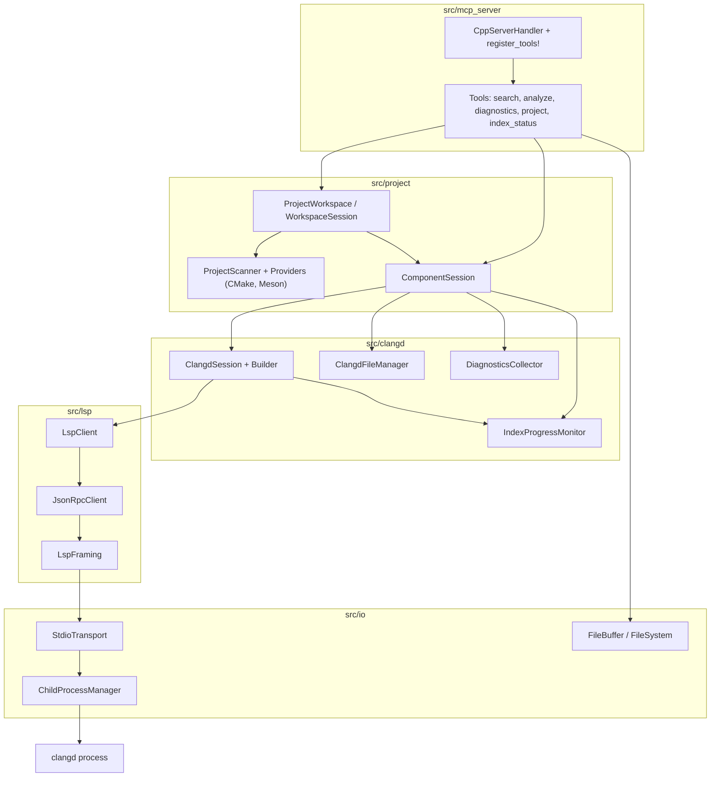
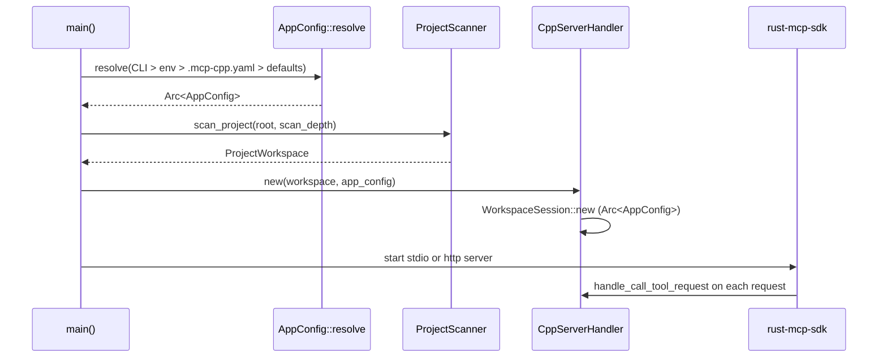
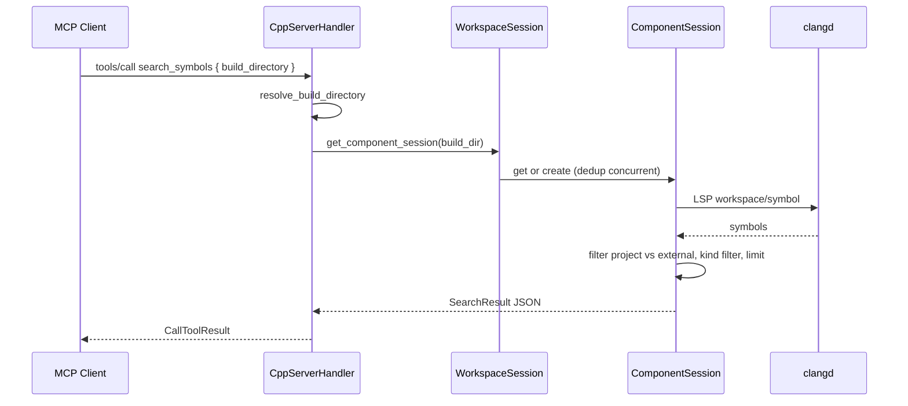

# Architecture

The server is a layered Rust application. Each layer is a module under `src/`, and dependencies flow strictly downward: the MCP handler calls the project/workspace layer, which calls the clangd session layer, which calls the LSP client, which calls the IO transport, which talks to the clangd process.

## Startup path

`main.rs` is the entrypoint. It parses CLI args with clap, initializes `tracing` logging, resolves the clangd path (CLI arg > `CLANGD_PATH` env > `"clangd"`), and scans the project root with `ProjectScanner::with_default_providers()` at depth 3. The resulting `ProjectWorkspace` and clangd path are handed to `CppServerHandler::new`, which wraps them in a `WorkspaceSession`. Depending on `--transport`, it then starts the rust-mcp-sdk stdio server or an HTTP (axum) server.

## Layered configuration (`src/config`)

`AppConfig` is the fully resolved configuration, merged from four sources in priority order: **CLI arguments > environment variables > `.mcp-cpp.yaml` in the project root > compiled-in defaults**. `AppConfig::resolve(&project_root, &cli_overrides, &SystemEnv)` performs the merge. A missing `.mcp-cpp.yaml` is the common case and silently falls back to defaults; a *malformed* file is fatal, because silently ignoring a config the user deliberately wrote is worse than refusing to start. The resolved `source_file` is logged at startup.

The file layer exists for portability: the same checked-out repository behaves the same on every machine that shares it, and per-machine details (a distro-specific clangd path, a smaller thread count on a laptop) move out of source code and into a file the user owns. Every field in `.mcp-cpp.yaml` is optional. `AppConfig` groups settings into `ClangdSettings` (path, extra_args, background_index, pch_storage, index_threads, workspace_symbol_limit, timeouts, index_wait_timeout), `ProjectSettings` (scan_depth, skip_hidden, follow_symlinks, max_components), and `ServerSettings` (http host/port). The `Arc<AppConfig>` is shared by `WorkspaceSession` and every `ComponentSession` it creates.

## The five layers

### 1. MCP server layer (`src/mcp_server`)

`CppServerHandler` (`src/mcp_server/server.rs`) implements the rust-mcp-sdk `ServerHandler` trait. It holds a single `WorkspaceSession`. The `register_tools!` macro generates a compile-time-safe dispatch table mapping tool names to async handlers. Each tool struct is annotated with `#[mcp_tool(...)]`, which derives its JSON schema for `tools/list`. See [MCP Tools](../tools-reference.md).

### 2. Project / workspace layer (`src/project`)

This layer turns a filesystem tree into a set of build configurations and manages per-component sessions:

- `ProjectScanner` + `ProjectProviderRegistry` walk the tree; each `ProjectComponentProvider` (CMake, Meson) detects build directories and produces a `ProjectComponent`.
- `ProjectWorkspace` is the immutable result of a scan - root path, components, scan depth, discovery timestamp, optional global compilation database.
- `WorkspaceSession` owns the workspace behind an `Arc<Mutex>` and manages a map of build directory to `Arc<ComponentSession>`. It deduplicates in-flight session creation with a `CreationSlot`/`Notify` pattern so concurrent tool calls for the same build dir share one clangd instead of racing to spawn two.
- `ComponentSession` owns one clangd: a `ClangdSession` (behind `Arc<Mutex>`), a `ClangdFileManager`, a `DiagnosticsCollector`, and the session's `IndexProgressMonitor`.

See [Project and Workspace](project-workspace.md).

### 3. clangd session layer (`src/clangd`)

`ClangdSession<P, C>` is generic over a `ProcessManager` and an `LspClientTrait` so tests can inject mocks. The production concrete type is `ClangdSession<ChildProcessManager, LspClient<StdioTransport>>`. A phantom-typed `ClangdSessionBuilder` enforces at compile time that you cannot `build()` without a config, and selects the real spawn-and-initialize path versus the test path based on whether dependencies were injected.

The session owns:
- an `IndexProgressMonitor` (`src/clangd/progress.rs`) that tracks clangd's LSP `$/progress` notifications on the `backgroundIndexProgress` token and exposes the latest `IndexStatus` plus a `watch`-channel `wait_for_completion`,
- the `LspClient` for typed requests.

Stderr is drained to prevent pipe-full blocking but is not parsed; clangd's `--log=verbose` is intentionally not added, because `$/progress` arrives regardless of log verbosity. `ClangdFileManager` tracks open documents and keeps clangd in sync with `didOpen`/`didChange`, using SHA-256 content hashing to avoid redundant notifications. `DiagnosticsCollector` captures `publishDiagnostics` notifications.

See [Clangd Session and Indexing](clangd-session.md).

### 4. LSP layer (`src/lsp`)

A clean three-layer stack over the generic `Transport` trait:

- `LspFraming<T>` adds the `Content-Length: N\r\n\r\n<content>` framing (capped at 16 MB).
- `JsonRpcClient<T>` is the async JSON-RPC 2.0 engine: it spawns a transport task, correlates responses by `u64` id, fans notifications out to all handlers, and dispatches requests to a single request handler.
- `LspClient<T>` wraps `JsonRpcClient` with typed `lsp_types` request/notification methods so method strings are compile-time-checked. It advertises capabilities (hover markdown, definition with `linkSupport`, document symbol with all 26 symbol kinds, `workDoneProgress`) and handles the clangd quirk where `linkSupport` is ignored and `Location[]` is returned instead of `LocationLink[]`.

`LspClientTrait` (with `mockall::automock`) abstracts the client for session polymorphism.

### 5. IO layer (`src/io`)

Protocol-agnostic primitives:

- `ChildProcessManager` spawns clangd with piped stdio, takes all three streams immediately, always drains stderr (even with no handler, to avoid pipe-full blocking), and tracks process state. `stop()` sends SIGTERM then SIGKILL on Unix; `kill_sync()` is the Drop safety net. Windows emits warnings instead.
- `StdioTransport` is channel-based: a stdin writer task and a stdout reader task that accumulates raw bytes and emits only complete valid UTF-8 prefixes, retaining partial multibyte sequences across reads.
- `FileBuffer<F>` is a UTF-8-normalized, line-indexed file view with auto-refresh on modification; columns are UTF-8 code points, not bytes. `FileBufferManager` caches buffers by path with a manager-owned filesystem for DI.

## Request flow: a tool call

The handler resolves the build directory (auto-detect if one, require explicit choice if many, or dynamically discover a hint path), gets or creates a `ComponentSession`, snapshots the component under a short lock, and runs the tool. The workspace lock is never held across a slow clangd query.

## Concurrency and locking discipline

- `WorkspaceSession` holds `Arc<Mutex<ProjectWorkspace>>`. Build-directory resolution takes the lock briefly, then releases it before session creation.
- `ComponentSession` wraps its `ClangdSession` and `ClangdFileManager` in `Arc<Mutex<...>>` so background tasks can share them.
- In-flight session creation uses a `CreationSlot` with `tokio::sync::Notify` - the first request to arrive registers as the creator; later concurrent requests await the same slot and receive the shared result.
- LSP notification handlers (`IndexProgressMonitor`, `DiagnosticsCollector`) spawn a background `tokio::task` per notification so the transport loop is never blocked.
- Index progress is best-effort and never back-pressures clangd: the `IndexProgressMonitor` updates a `watch` channel, and waiters subscribe rather than blocking the notification path.