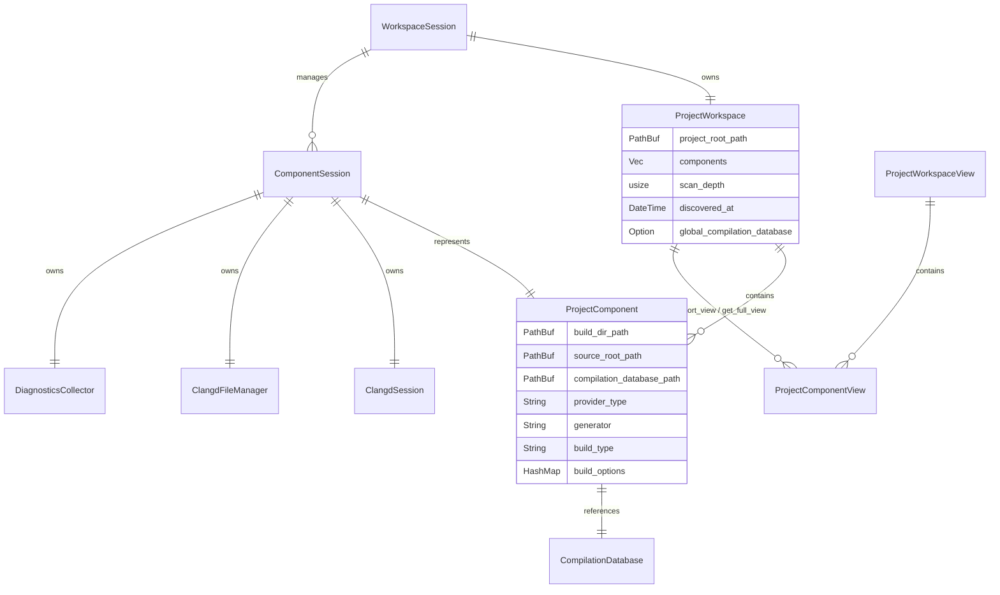
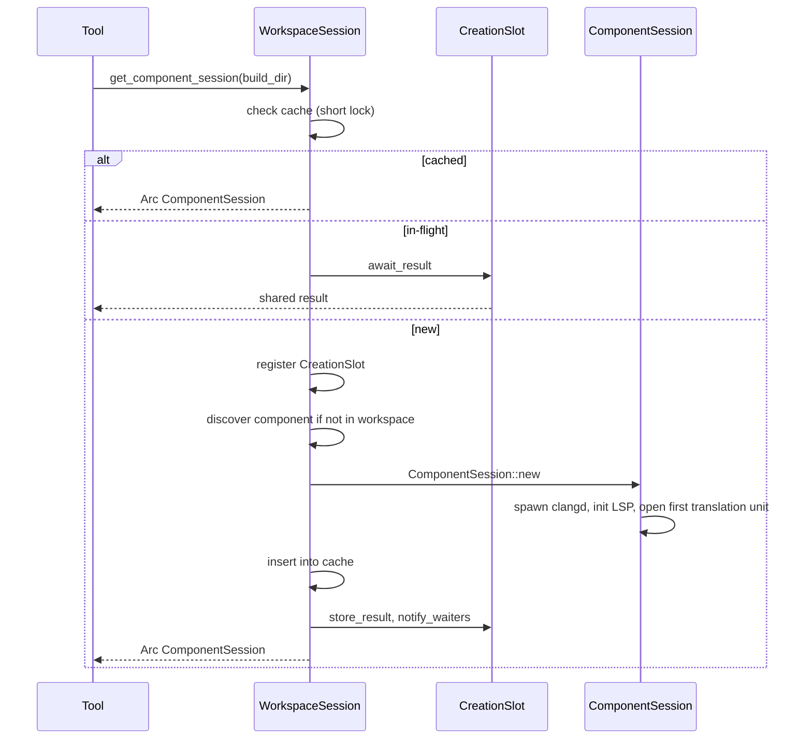

# Project and Workspace Subsystem

The `src/project` module turns a filesystem tree into a set of build configurations and manages the per-component sessions that own clangd processes. It is built around an extensible **provider pattern** so new build systems can be added without changing the scanner.

## Scanning and provider discovery

`ProjectScanner` (`src/project/scanner.rs`) holds a `ProjectProviderRegistry` and walks the tree with `walkdir`, bounded by a `depth` parameter and `ScanOptions` (skip hidden dirs by default, no symlink following, optional `max_components`). For each directory, `ProjectProviderRegistry::scan_directory` tries each registered `ProjectComponentProvider` in order; the first that returns `Ok(Some(component))` wins, and a provider returns `Ok(None)` for directories it cannot handle.

`ProjectScanner::with_default_providers()` registers `CmakeProvider` and `MesonProvider`. `discover_component(build_dir)` scans a single directory (no traversal) for dynamic discovery when a tool references a build directory that was not in the initial scan.

### CMake provider

`CmakeProvider` (`src/project/cmake_provider.rs`) detects a CMake build directory by locating `CMakeCache.txt` and parsing it line by line. It extracts:
- `CMAKE_GENERATOR` -> `generator` (e.g. `Ninja`, `Unix Makefiles`)
- `CMAKE_BUILD_TYPE` -> `build_type` (e.g. `Debug`, `Release`)
- `CMAKE_SOURCE_DIR` -> `source_root_path` (falls back to `<PROJECT_NAME>_SOURCE_DIR`)
- all other keys -> `build_options` map

It locates `compile_commands.json` in the build directory.

### Meson provider

`MesonProvider` (`src/project/meson_provider.rs`) detects a Meson build directory by locating a `meson-info` directory. It parses:
- `meson-info/intro-buildoptions.json` -> `build_options`
- `meson-info/intro-projectinfo.json` -> `source_dir`
- `meson-info/intro-buildsystem_files.json` (fallback source dir)
- `meson-info/intro-targets.json` (for target metadata)

The provider type string is `"cmake"` or `"meson"`; the generator for Meson is typically `"ninja"`.

## Data model

`ProjectComponent::new` validates that the build directory and source root exist and are directories, and that `compilation_database_path` exists.

`ProjectWorkspace` provides `get_short_view()` (excludes full `build_options`, includes `build_options_count` and aggregated `compiler_options` from a bounded sample of `compile_commands.json`) and `get_full_view()` (includes all `build_options`). The short view exists to prevent context-window exhaustion when agents call `get_project_details`.

`CompilationDatabase` (`src/project/compilation_database.rs`) wraps `json_compilation_db` and provides `BuildOptions` aggregation (defines, include paths, language standard, optimization, flags) from a bounded sample of entries.

## Session lifecycle

### WorkspaceSession

`WorkspaceSession` (`src/project/workspace_session.rs`) is the long-lived owner created in `main.rs`. It:
- holds `Arc<Mutex<ProjectWorkspace>>` so dynamic discovery can add components,
- holds a shared `Arc<AppConfig>` (resolved from CLI > env > `.mcp-cpp.yaml` > defaults),
- maintains `component_sessions: Arc<Mutex<HashMap<PathBuf, Arc<ComponentSession>>>>`,
- deduplicates in-flight creation with `session_creation: Arc<Mutex<HashMap<PathBuf, Arc<CreationSlot>>>>`.

`get_component_session(build_dir)`:

The cache lock is held only for the lookup, never across clangd startup, to avoid deadlocks. The `CreationSlot` uses a `tokio::sync::Notify`; the creator stores the result and notifies, concurrent waiters receive the same `Arc<ComponentSession>`.

### ComponentSession

`ComponentSession` (`src/project/component_session.rs`) owns all resources for one build directory:

| Field | Role |
|---|---|
| `clangd_session: Arc<Mutex<ClangdSession>>` | The clangd process + LSP client |
| `file_manager: Arc<Mutex<ClangdFileManager>>` | LSP document sync state |
| `index_wait_timeout: Duration` | Bound for waiting on clangd's index progress (from `AppConfig`) |
| `component: ProjectComponent` | Metadata (build type, generator, paths) |
| `diagnostics_collector: Arc<DiagnosticsCollector>` | Captured `publishDiagnostics` |

Index status is not stored on the session as a separate field; it is read on demand from the `IndexProgressMonitor` owned by the underlying `ClangdSession` (see [Clangd Session and Indexing](clangd-session.md)). `ComponentSession` exposes `index_status()` and `wait_for_index_status(timeout)` as thin wrappers over the monitor.

Construction (`ComponentSession::new`) is async and does the real work:
1. Build a `ClangdConfig` via `ClangdConfigBuilder` from the `AppConfig` clangd settings - working directory is the project root, build directory is the component's build dir. `--log=verbose` is intentionally **not** added: it generates a huge stderr volume and clangd's `$/progress` arrives regardless of log verbosity.
2. `ClangdSessionBuilder::new().with_config(config).build().await` spawns clangd and initializes LSP.
3. Register the `DiagnosticsCollector` notification handler on the LSP client.
4. Open one real translation unit from the compilation database through `ClangdFileManager::ensure_file_ready`, to give a fresh CLI invocation its first compilation context (clangd remains solely responsible for all indexing and progress reporting).

The session exposes accessors (`component()`, `lsp_session`, `ensure_file_ready`, `close_file`, `get_file_diagnostics`, `index_status`, `wait_for_index_status`, `index_wait_timeout`) used by the tools. `ensure_indexed` is a legacy test-only no-op retained for the integration suites - there is no client-side indexing phase anymore.

## Error model

`ProjectError` (`src/project/error.rs`) covers path/validation/parse/IO/session-creation failures. Notable variants: `BuildDirectoryNotReadable`, `SourceRootNotFound`, `CompilationDatabaseNotFound`, `InvalidBuildDirectory`, `PathNotFound`, `ParseError`, `SessionCreation(String)`. Tool handlers map these to `CallToolError`.