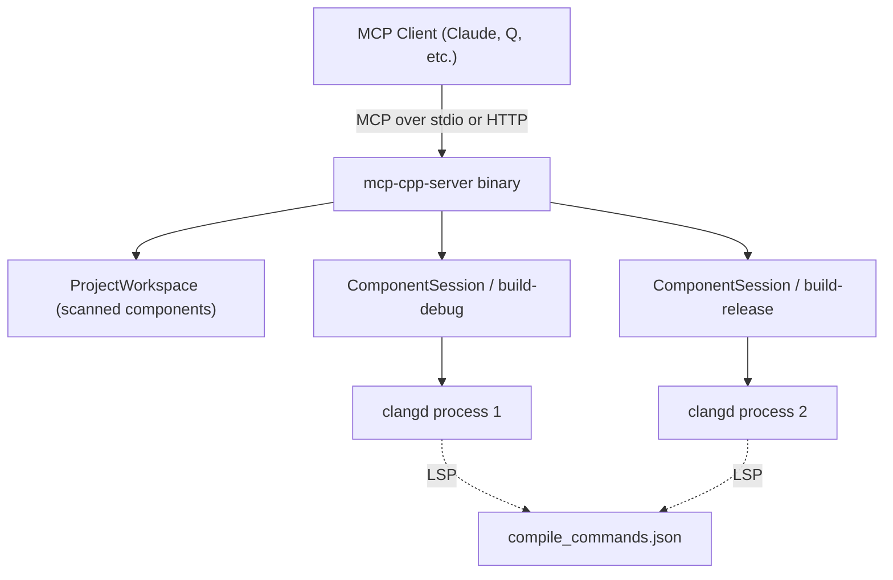

# C++ MCP Server Overview

`mcp-cpp-server` is a Rust binary that implements the Model Context Protocol (MCP) and bridges AI agents to clangd, the LLVM C++ language server. It gives agents the same semantic understanding of C++ code that an IDE has - symbol search, definition/declaration resolution, inheritance and call hierarchies, usage examples, and compile diagnostics - instead of forcing them to rely on text-only tools like `grep` or `find`.

The server is built on the [rust-mcp-sdk](https://crates.io/crates/rust-mcp-sdk) and speaks MCP over **stdio** (the default, when spawned by an MCP client) or **streamable HTTP** (a standalone axum server selected with `--transport http`). It targets Rust edition 2024 and is published to crates.io as `mcp-cpp-server` (current version 0.2.2).

## What it does

The server scans a project root for CMake and Meson build directories (each containing a `compile_commands.json`), spawns one **clangd** process per build directory on demand, and exposes five MCP tools that translate agent requests into LSP calls against that clangd:

| Tool | Purpose |
|---|---|
| `get_project_details` | Discover build configurations and return absolute build directory paths |
| `search_symbols` | Fuzzy workspace symbol search or full file symbol enumeration |
| `analyze_symbol_context` | Deep analysis of one symbol - definitions, members, inheritance, call hierarchy, usage examples |
| `show_diagnostics` | clangd compile errors/warnings/notes for a single source file |
| `get_index_status` | Lightweight indexing progress report for a build directory |

## Core design principles

- **Multi-component.** A single server can manage several C++ projects or build configurations at once (e.g. an embedded Linux tree with many subprojects). Each build directory gets its own lazily-created `ComponentSession` and clangd process.
- **Semantic, not textual.** Results come from clangd LSP queries, so they understand templates, namespaces, macros, and project boundaries rather than matching raw text.
- **Project vs. external filtering.** By default the server filters out system and third-party symbols, using the compilation database to determine what belongs to the project. `include_external: true` extends the scope.
- **Indexing-aware.** clangd's background indexing is tracked via both LSP `$/progress` notifications and stderr log parsing. Tools wait (with a configurable timeout, default 20s) for indexing to produce complete results, and surface index status in their output when they time out.

## Runtime topology

The server scans once at startup, then creates `ComponentSession` instances lazily as tools request different build directories. Each session owns a clangd process, a file manager, a diagnostics collector, and an index monitor.

## Installation and configuration

Install from crates.io (`cargo install mcp-cpp-server`), from source, or via the Docker image (which bundles clangd-20). MCP clients configure it as an MCP server entry pointing at the `mcp-cpp-server` binary. Key configuration:

| Source | Keys |
|---|---|
| CLI args | `--root <DIR>`, `--clangd-path <PATH>`, `--transport stdio\|http`, `--host`, `--port`, `--log-level`, `--log-file` |
| Environment | `CLANGD_PATH` (default `clangd`), `RUST_LOG` (default `info`), `MCP_LOG_FILE`, `MCP_LOG_UNIQUE` |

See [Quickstart](quickstart.md) for MCP-client configuration examples and the [Tool Reference](tools-reference.md) for tool schemas.