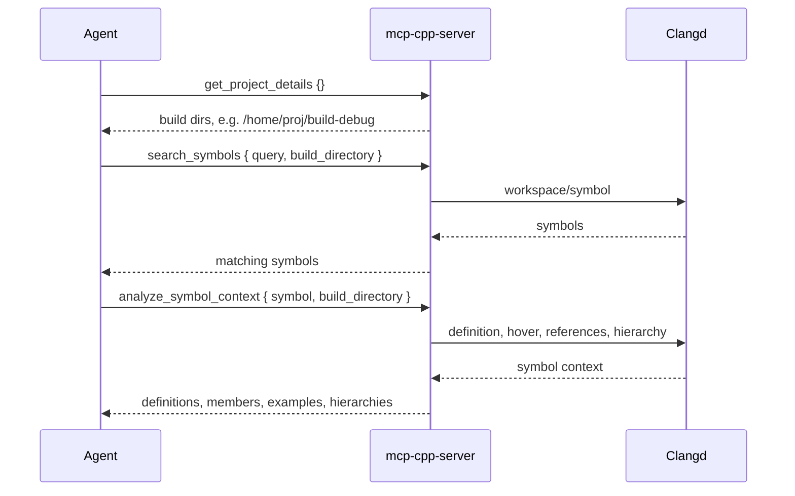

# Quickstart

## Prerequisites

- **clangd 11 or later** (clangd 20+ recommended). The Docker image ships clangd-20.
- **Rust 2024 edition** to build from source.
- A **CMake or Meson** C++ project that generates a `compile_commands.json`. For CMake, set `CMAKE_EXPORT_COMPILE_COMMANDS ON`.

## Install the server

```bash
# From crates.io (recommended)
cargo install mcp-cpp-server

# From source
git clone https://github.com/mpsm/mcp-cpp.git
cd mcp-cpp
cargo install --path .

# Docker
docker build -t mcp-cpp-server .
```

Set `CLANGD_PATH` if clangd is not on `PATH`, e.g. `CLANGD_PATH=/usr/bin/clangd-20`.

## Configure an MCP client

Add the server to your MCP client config. All examples below expose the same four-analysis-tool surface.

**Claude Desktop / Claude CLI** (`~/.claude_desktop_config.json` or `~/.config/claude-cli/mcp_servers.json`):

```json
{
  "mcpServers": {
    "cpp-tools": {
      "command": "mcp-cpp-server",
      "env": { "CLANGD_PATH": "/usr/bin/clangd-20" }
    }
  }
}
```

**Claude Code** (`~/.claude.json`) requires explicit permissions and a `type`:

```json
{
  "mcpServers": {
    "cpp": {
      "type": "stdio",
      "command": "~/.cargo/bin/mcp-cpp-server",
      "env": { "CLANGD_PATH": "/opt/homebrew/opt/llvm/bin/clangd" }
    }
  },
  "permissions": {
    "allow": [
      "mcp__cpp__search_symbols",
      "mcp__cpp__analyze_symbol_context",
      "mcp__cpp__get_project_details",
      "mcp__cpp__show_diagnostics",
      "mcp__cpp__get_index_status"
    ]
  }
}
```

**Docker**:

```json
{
  "mcpServers": {
    "cpp-tools": {
      "command": "docker",
      "args": ["run", "-i", "--rm", "-v", "/path/to/cpp-project:/workspace", "mcp-cpp-server", "--root", "/workspace"]
    }
  }
}
```

## Recommended agent workflow

The tool descriptions deliberately steer agents through this sequence. The reason: `get_project_details` returns **absolute** build directory paths, and passing those absolute paths to the other tools avoids relative-path concatenation bugs.



1. **`get_project_details {}`** - discover available build directories and their absolute paths.
2. **`search_symbols { "query": "...", "build_directory": "/abs/build" }`** - find symbols. Use an empty query (`""`) with a `files` list to enumerate every symbol in a header, or an empty query without files for project-wide discovery.
3. **`analyze_symbol_context { "symbol": "MyClass", "build_directory": "/abs/build" }`** - get the full context (definitions, members, inheritance, call hierarchy, usage examples) for one symbol.

## Python CLI for debugging

The repository includes `tools/lsp-cli.py`, a command-line MCP client that shows exactly what an agent would see. It is not shipped in the crate; run it from a checkout:

```bash
pip install -r tools/requirements.txt
python3 tools/lsp-cli.py get-project-details
python3 tools/lsp-cli.py search-symbols "MyClass"
python3 tools/lsp-cli.py analyze-symbol "MyClass::process"
python3 tools/lsp-cli.py show-diagnostics src/main.cpp
python3 tools/lsp-cli.py get-index-status --build-directory /abs/build
```

See [Tool Reference](tools-reference.md) for the full schema of every tool.